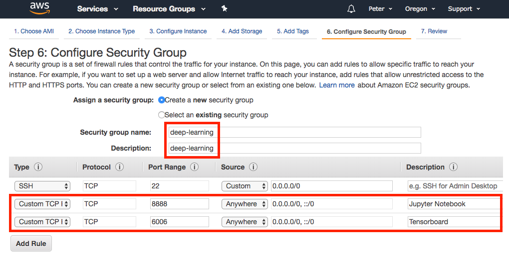
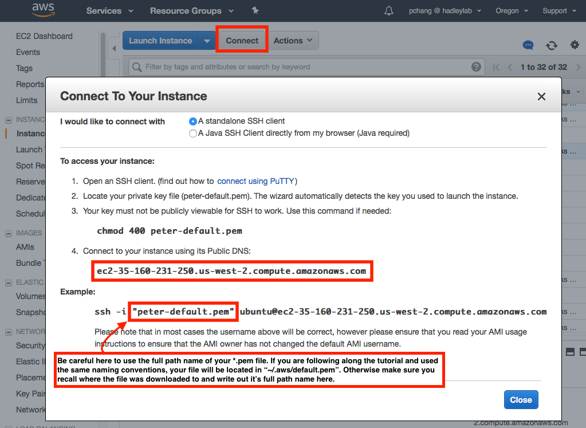
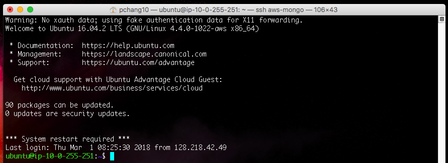

# Overview

This repository contains the code examples and prerequisite materials for the hands-on Deep Learning Tutorial at the ISMRM Machine Learning Workshop 2018, as well as instructions for creating a new AWS EC2 GPU instance pre-configured with all the required Python dependencies, CUDA/cudNN libraries and training data for following along the course.

1. How to create a new AWS EC2 instance.
2. How to access the  AWS EC2 instance.  
3. How to run Jupyter notebook.

### Important Note

You should try to complete steps (1) and (2) above several days BEFORE the session as a new AWS user will by default to complete a separate request for GPU-enable instances (requires up to 24 hours for approval).

# Create AWS Instance

### Sign up for AWS account

New users to Amazon AWS have access to a free tier of services for the initial 12 months of subscription. Note that the GPU EC2 instance required for deep learning is not part of the free tier of services ($0.90/hour) however an Amazon AWS account is still required. 

To sign up, begin by visiting: https://portal.aws.amazon.com/billing/signup#/start 


Note that your chosen `AWS account name` cannot contain spaces or non-alphanumeric characters (`{}[]()/\'"~,;:.<>`). Follow the prompts on the remaining screens. A valid credit card will be required.

### Login to EC2 console (dashboard)

Use the following link to log into your new AWS account: https://console.aws.amazon.com/console/home


Enter the email address of your AWS account here.


Enter the password of your AWS account here.

After logging in you will arrive at a launch page of various AWS services. We want to specifically manage EC2 instances. To navigate to the EC2 dashboard, click on the `Services` dropdown menu in the top left hand corner of the banner. You should now have a screen that looks like this:


Click on the `EC2` link under the first `Compute` header within the first column. You have now arrived at the EC2 console (dashboard):


Here you can manage the servers in your AWS cloud, including creating, terminating, starting and stopping individual EC2 instances. For more general information about EC2 services and the console, see Amazon documentation here: https://aws.amazon.com/ec2/getting-started/ 

### Request a GPU instance limit increase

By default Amazon does not allow a user to create a new GPU-based instance to prevent accidental incurrence of charges. To request that AWS increase your limit from 0 to 1, click on the `Limits` link on the EC2 console. Scroll down until you see the `p2.xlarge` selection and click on the corresponding link for `Request limit increase`. 


Complete the following request with the settings shown below:


### Create a new EC2 instance

After logging into the EC2 console (see instructions above) we will now create a new EC2 instance. The EC2 instance will be generated from a preconfigured Amazon Machine Image (AMI). To ensure that this AMI is visible to your AWS account, make sure you are in the `US West (Oregon)` region of service by changing the context in the top right hand corner of the banner as needed:


Now to begin creating a new instance, click the `Instances` link on the left hand toolbar:


Click on the blue `Launch Instance` button.

For the first step, choose `Community AMIs` on the left hand toolbar and type in `ami-92da53ea` into the `Search community AMIs` query field. Click on the blue `Select` button to choose this template image. This step configures the baseline software for the new EC2 instance. The remaining steps configure the baseline hardware and network protocol settings.


For the second step, we need to choose the EC2 instance type. Scroll down the page until you get to `p2.xlarge` in the Instance Type column. This is the baseline single GPU instance.


On the top set of links, click on `Add Storage` to configure the storage settings for the EC2 instance. Free tier users recieve up to 30 GiB of storage without charge, so we will configure this instance with 30 GiB of SSD storage. 


On the top set of links, click on `Add Tags` to name your new EC2 instance (for your own personal benefit in case you may have multiple EC2 instances to keep track of). In the middle of the screen click the link for `click to add a Name tag` and complete with an appropriate name:


On the top set of links, click on `Configure Security Group` to set up port firewall settings. First we will create an arbitrary name for this profile of settings by changing `Security group name` and `Description` to `deep-learning`. By default port 22 (for SSH) is allowed. In addition we must open the default Jupyter notebook port 8888 to allow you to connect to the EC2 instance and edit code through a web browser. To do so, click `Add Rule` and fill in the following settings:



On the top set of links, click on `Review` to see a summary of the EC2 settings. Click on the bottom right hand `Launch` button to complete the set up process and spin up your new EC2 instance. 


# Accessing AWS Instance

### Launch EC2 instance 

Upon creating your EC2 instance with the instructions, the new EC2 instance will be automatically started. On each subsequent future session, you will have to start (e.g. boot) your EC2 instance before you can connect and use it. To do so, select the `Instances` link on the left hand toolbar, select the instance you want to boot (blue check box to the left of the instance name), select `Actions` > `Instance State` > `Start`. Your EC2 instance will be ready to connect in about 30-60 seconds.


### SSH into EC2 instance

There are two options to start a remote connection to your EC2 instance. Instructions can be found by selecting a particular EC2 instance (blue check box to the left of the instance name) and clicking the `Connect` button. 



The recommended option is to connect through a standalone SSH client (from your local machine). To do so, follow the instructions on the `Connect` screen. Note here that the `*.pem` file in the next steps references the SSH key you set up in the instructions for creating your EC2 instance above. If you chose to use the default settings of the tutorial above then the path to your `*.pem` file will be `~/.aws/default.pem`, otherwise replace this path with your local path based on the location you saved the file.

The first time you connect will need to adjust the permissions on the `*.pem` file SSH key. To do so, open up a terminal and type in the following command:
```
chmod 400 /path/to/your/pem/file
```
If you followed the default settings of the tutorial above, this would be:
```
chmod 400 ~/.aws/default.pem
``` 

To connect to the instance, use the SSH client of your choice. For Max OS X users, the default SSH client is recommended, and can be accessed by opening the Terminal (Applications > Utilities) and typing the following command:
```
ssh -i "/path/to/your/pem/file" ubuntu@[ec2-public-dns]
``` 
Note the you should replace [ec2-public-dns] with your EC2 instances public DNS. In the above screenshot this would be `c2-35-160-231-250.us-west-2.compute.amazonaws.com`. Assuming that your SSH key is located at `~/.aws/default.pem` then the full command would be:
```
ssh -i "~/.aws/default.pem" ubuntu@c2-35-160-231-250.us-west-2.compute.amazonaws.com
```

You should now be successfully logged into your remote SSH session:



### Stop EC2 instance 

AWS charges a fixed cost per hour of EC2 instance usage, proprated to the second. To keep your charges low, it is advised to stop (e.g. turn off) your EC2 instance whenever your are finished. To do so, select the `Instances` link on the left hand toolbar, select the instance you want to boot, select `Actions` > `Instance State` > `Stop`.

# Starting Jupyter Notebook 

During the tutorial session, all code written by the participants will be completed using the Jupyter Notebook, an iPython kernel / server that will be running from your own personal AWS instance and accessed through a web-browser. Through this web-based interface one will be able to write, edit and run code in an easy way without needing to use the Linux command line. For more advanced users, this entire Github repository is available for access from the command line at `~/dl_tutorial`. See below for more information.

# Advanced Users

For more advanced users wishing to follow along directly through the EC2 command line instead of the Jupyter Notebook, these are instructions for basic access. In the EC2 instance, all required dependencies have been installed in a separate Conda virtual enivornment named `dl_aws`. To activate simply run:
```
source activate dw_aws
```

From here simply access code and materials from this cloned Github repository at `~/dl_tutorial`. You may use your favorite editor. Note that `vim` has been preconfigured with syntax highlighting, Vundle and several useful plugins for Python development (see `~/.vimrc` for further details). Code may be executed with either `python` or the `ipython` kernel.
